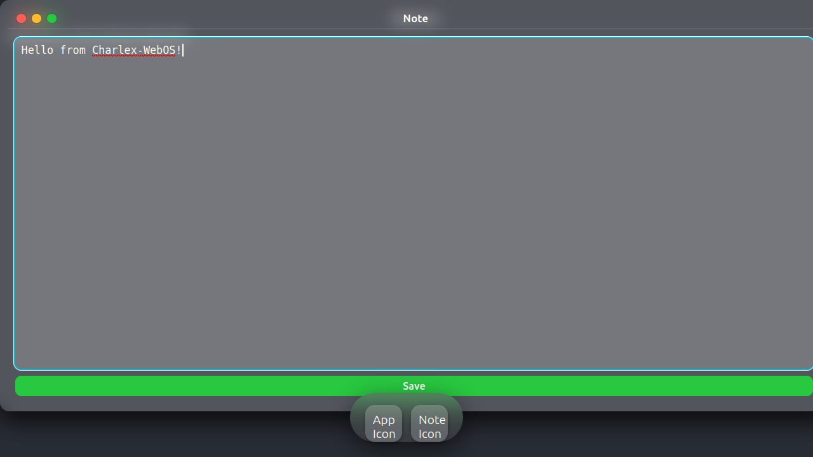

# About Charlex WebOS

Charlex WebOS is a web-based simulation of a real operating system. It is easy to use and looks like a real OS. The main program is written in Python files like `app.py` and `window_manager.py`. The user interface uses HTML templates in the `templates/` directory. Static files like styles, scripts, and images are in the `static/` directory.

This project is simple, easy to grow, and easy for people to help improve.

- Free and open source
- Fast and easy to use
- Designed to add new features easily

## What you need

To run Charlex WebOS, you need:

- Python 3
- Flask web framework

## How to set up

1. Create and start a Python virtual environment:

```bash
python3 -m venv venv
source venv/bin/activate
```

2. Install the needed Python packages:

```bash
pip install -r requirements.txt
```

## How to run

Start the Flask server by running:

```bash
python app.py
```

Open your web browser and go to `http://localhost:5000` to use Charlex WebOS.

## Documentation

For more information about Flask, see the official Flask docs: [https://flask.palletsprojects.com/](https://flask.palletsprojects.com/)

## How to help

You can help by sending your changes. Fork the project, make your changes, and send a pull request. Please follow the current style and add comments.

## License

Charlex WebOS uses the license in the [LICENSE](./LICENSE) file.

---

## Project overview

Charlex WebOS is a web-based simulation that looks and works like a real operating system. It gives an easy and nice interface like a normal OS.

- **Source files:** The main code is in `app.py` and `window_manager.py`. They handle the main functions and window management.
- **Templates:** The `templates/` directory has HTML files for the user interface.
- **Static files:** The `static/` directory has images, styles, and scripts.
- **Virtual environment:** The `venv/` directory keeps the Python environment separate.
- **Version control:** The `.git/` directory tracks changes and helps teamwork.

This structure makes it easy to add new features and for people to help.

Thanks to the Gnu/Linux community for inspiration.

# Screenshots


